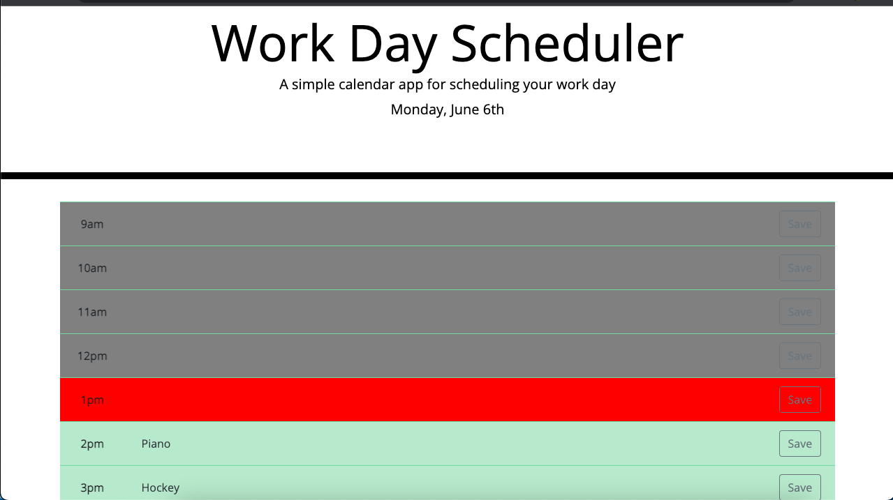

# workDayScheduler

Workday Scheduler saves events entered during the standard business hours of 9am-5pm
Houred time blocks are green for the future, gray for the past and red for current.
To clear the scheduler, simply delete local storage

https://monaco-vin.github.io/workDayScheduler/

